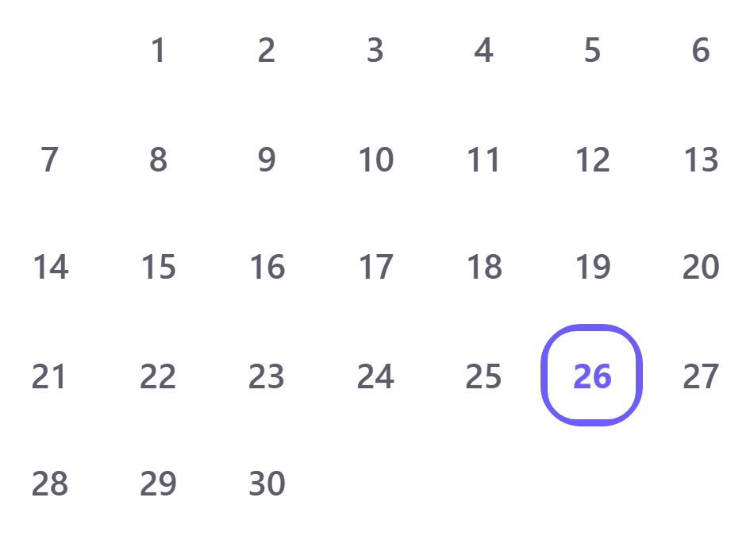
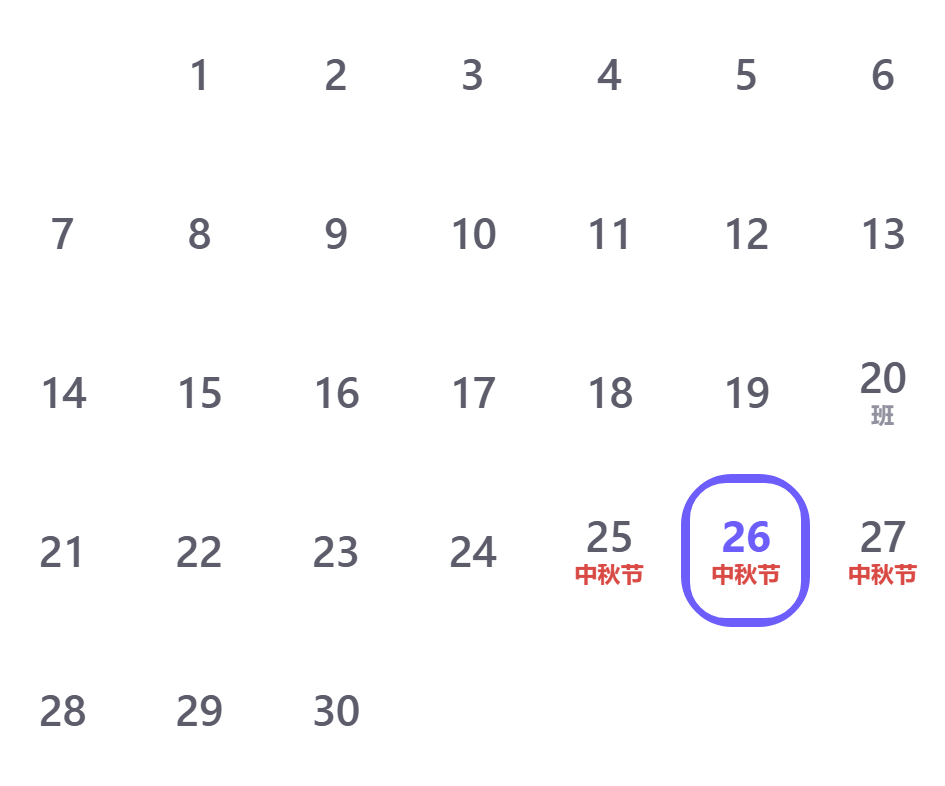

# 独立验证报告 · task-5（A / B / C）

> 验证者：`verifier`（独立第三方，非作者）
> 日期：2026-09-26
> 工程：`E:\DeepSeek\workhours-app`（React 18 + Vite 6 + TS + Capacitor 7）
> 本轮范围：**A 节假日数据 / B 日历节假日显示 / C 底部导航居中**。
> D（性能）**本轮未做** —— 性能队友仍在改动，等落地后补测。

---

## 0. 结论一句话

**A、B、C 三项在我能触达的范围内全部通过**：节假日数据与国务院原文逐条一致（另经香港天文台历表独立推导佐证）；日历里 `2026-09-25` 的「中秋节」三个字真的渲染在 DOM 里、可见、且与其它 6 个节日同位置同字号同颜色同层级；底部药丸指示器在 13 种视口/缩放/DPR 组合 × 4 个 tab 共 52 次测量下偏差 **全部为 0.000px**。

但我复现出 **1 个证据完整性问题**和 **1 个非验收口径的 UX 问题**，见 §5。**最重要的那条：验证过程中 `dist/` 被重新构建了**，我早期的证据一度对应旧产物，已全部重跑并锁定指纹。

---

## 1. 验收口径与手段（先说清楚「我到底测了什么」）

| 项 | 说明 |
|---|---|
| 验收目标 | 手机 WebView / 打包 App（iPhone 14 Pro，393×852，DPR 3，`viewport-fit=cover`） |
| 实际手段 | **Chromium 设备模拟**（Playwright，`isMobile`+`hasTouch`+DPR+viewport） |
| 被测产物 | `dist/`（`vite preview` 在 `http://127.0.0.1:4173` 发的字节），**不是源码** |
| 产物指纹 | `index-3Th5TvbA.js` sha256:`0B03609C93ED80E5` ／ `index-7Pwbk8Wh.css` sha256:`C7B4F1C60B891379` |
| 指纹稳定性 | 三次全量重跑前后各取一次哈希，**一致**（整轮测的是同一份产物） |

**明确区分：**
- ✅ **设备模拟得到的结论**：DOM 结构、computed style、几何/包围盒测量、命中测试、横向滚动、控制台报错、跨月/跨年/闰年状态机、缩放/DPR 下的布局。
- ❌ **只能真机复测**：`env(safe-area-inset-bottom)` 真实值（Chromium 恒为 0）、Android WebView 与 iOS WKWebView 的字体度量差异、真实触摸与合成器帧率、横竖屏旋转、系统字体放大。

> 全部三个脚本一次性可复跑，退出码均为 0：
> ```powershell
> cd E:\DeepSeek\workhours-app
> node scripts/verify-sources.mjs     # 抓回来的官方原文 → 抽正文
> node scripts/verify-holidays.mjs    # A：编译真实 src/lib/holidays.ts 后跑 88 条断言
> node scripts/verify-calendar.mjs    # B：Playwright 167 条断言
> node scripts/verify-tabbar.mjs      # C：Playwright 28 条断言
> ```
> 预览服务：`npx vite preview --host 127.0.0.1 --port 4173`

---

## 2. A 节 · 节假日数据正确性（88 条断言，0 失败）

### 2.1 `2026-09-25` 是不是中秋节 —— 我用两个互不相干的权威来源各自核实

我没有采信任何人的说法（包括作者脚本里的注释），而是自己抓原文：

**来源 1 · 国务院办公厅《关于2026年部分节假日安排的通知》（国办发明电〔2025〕7号）**
我自己抓的页面：`verification/raw/gov-2026.htm`（27547 B，sha256:`36FE1206CEB7685B`），正文原文：

> 六、中秋节：**9月25日（周五）至27日（周日）放假，共3天。**

**来源 2 · 香港天文台《公曆與農曆日期對照表》T2026c**
`verification/raw/hko-T2026c.txt`（23536 B，sha256:`7B0831ACb16A5A72`）。该表只在农曆初一那行写月份名，所以我程序化定位「农曆月名 == 八月」的那一天当作八月初一，再 +14 天：

```
農曆「八月」初一落在：2026-09-11(星期五)
⇒ 八月初一 2026-09-11 + 14 天 = 八月十五 = 2026-09-25（星期五）
```

**两个来源独立吻合：`2026-09-25` = 農曆八月十五 = 中秋节，且都是周五。** 作者模块的结论正确。

作为交叉印证，同一套方法对 2025 年也算了一遍：
```
農曆「八月」初一落在：2025-09-22(星期一)
⇒ 八月初一 2025-09-22 + 14 天 = 八月十五 = 2025-10-06（星期一）
```
与官方原文「国庆节、中秋节：10月1日（周三）至8日（周三）放假调休，共8天」自洽（2025 年中秋确实落在国庆长假里的 10 月 6 日）。

### 2.2 点名抽查（全部通过，数值如下）

| 日期 | 期望 | 实测 `getHoliday()` |
|---|---|---|
| 2026-09-25 | 中秋节 holiday | `{"name":"中秋节","kind":"holiday"}` ✅ |
| 2026-09-24 / 09-28 | 无 | `null` ✅ |
| 2026-09-25~27 三天 | 都是中秋节 | `["中秋节","中秋节","中秋节"]` ✅ |
| 2025-10-01 | 国庆节 | `{"name":"国庆节","kind":"holiday"}` ✅ |
| 2025-01-01 | 元旦 | `{"name":"元旦","kind":"holiday"}` ✅ |
| 2025 春节 | 2025-01-28 ~ 02-04，8 天 | 首末日均 holiday，共 8 天 ✅ |
| 2025 端午 | 2025-05-31 ~ 06-02 | 首末日均 holiday ✅ |
| 2025 清明 | 2025-04-04 ~ 04-06 | 首末日均 holiday ✅ |
| 2025 劳动节 | 2025-05-01 ~ 05-05 | 首末日均 holiday ✅ |
| 2025-10-06 | 中秋节（HKO 推导） | `{"name":"中秋节","kind":"holiday"}` ✅ |
| 2025-10-01~08 八天 | 逐日非空 | 无空档 ✅ |

### 2.3 官方区间逐日核对 + 天数合计

三年 **20 个放假区间逐日展开，每一天都核**，无一天落空、无一天名字错：

| 年 | 元旦 | 春节 | 清明 | 劳动 | 端午 | 中秋 | 国庆 | 合计 |
|---|---|---|---|---|---|---|---|---|
| 2024 | 1 | 8 | 3 | 5 | 1 | 3 | 7 | **28** |
| 2025 | 1 | 8 | 3 | 5 | 3 | (并入国庆8天) | 8 | **28** |
| 2026 | 3 | 9 | 3 | 5 | 3 | 3 | 7 | **33** |

合计 **89 天**，与实测 `holiday` 天数一致。

另外把官方原文里显式标注的 **36 处「周X」** 全部拿来对我自己用 `Date.UTC` 独立算出的星期，**36/36 全部自洽** —— 这一条能查出「日期抄串行」「年份张冠李戴」这类错误。2026-09-25 原文标「周五」，实算也是周五。

### 2.4 调休上班日 `kind='workday'`

| 年 | 天数 | 全部 `kind='workday'` | 星期与原文一致 | 全落在周六/周日 | `isRestDay()=false` |
|---|---|---|---|---|---|
| 2024 | 8 | ✅ | ✅ | ✅ | ✅ |
| 2025 | 5 | ✅ | ✅ | ✅ | ✅ |
| 2026 | 6 | ✅ | ✅ | ✅ | ✅ |
| 合计 | **19** | | | | |

2026 年 6 个调休日 = `01-04 02-14 02-28 05-09 09-20 10-10`，与原文逐条一致。
> 注意一个容易误读的点：**2026-09-20（周日）上班是挂在官方「国庆节」条款下的**（原文第七条：「国庆节：…9月20日（周日）、10月10日（周六）上班」），不是中秋节的调休。作者把它放进 workdays 数组是对的，中秋节本身确实不调休。

### 2.5 非法输入（34 个坏输入 + 5 个未知年份）

```
坏输入：null / undefined / '' / ' ' / '2026-13-45' / '2026-02-30' / '2026-9-25' /
        '2026/09/25' / '2026-09-25 ' / '2026-09-25T00:00:00Z' / 'null' / 'undefined' /
        'NaN' / '__proto__' / 'constructor' / 全角'２０２６-０９-２５' / 0 / 1 / NaN /
        Infinity / true / false / {} / [] / [2026,9,25] / '2026' / '2026-09' /
        '0000-00-00' / '9999-99-99'
未知年份：2023-12-31 / 2027-01-01 / 2030-06-10 / 2100-01-01 / 1900-01-01
```

- **零抛异常**（含无参调用、含带恶意 `toString` 的对象 —— 确认没去碰它）
- `getHoliday()` → 一律 `null`（**不是 `undefined`**，也不是字符串 `'null'`）
- `holidayName()` → 一律 `null`
- `isRestDay()` → 一律 `false`
- 未知年份不瞎猜：格式合法但没数据 → `null` / `false`

### 2.6 我额外加的独立不变量（作者脚本没查的，全部通过）

- **「放假区间」与「调休上班日」零重叠** —— `TABLE` 是 `Map`，后写的会静默覆盖先写的；真撞上会**悄悄吞掉一个假期**。实测三年零碰撞。
- 同年假期区间互不重叠；所有区间首 ≤ 尾且是真实存在的日子。
- **1096 天全量遍历**：`isRestDay()` 与 `getHoliday()` **零矛盾**；零抛错；返回值形状全合法；没有空/`undefined`/`null` 名字。
- 返回值被冻结，外部改不动共享对象。

### 2.7 与作者自检脚本交叉验证

未修改、原样跑作者的 `scripts/check-holidays.mjs`：**137 项断言全部通过，exit 0**。他的期望值与我独立手抄的原文一致，两组口径互证。

---

## 3. B 节 · 日历界面真的显示了节假日（167 条断言，0 失败，1 条 WARN）

### 3.1 核心断言 —— `2026-09-25`

浏览器实测（Playwright，iPhone 14 Pro 模拟），不是读代码：

| 测量项 | 实测值 |
|---|---|
| 格子存在 | `.day[data-date="2026-09-25"]` ✅ |
| classes | `["day","has-holiday"]` |
| 日号文本 | `"25"` |
| **`.day-holiday` 文本** | **`"中秋节"`** ✅ |
| 可见性 | `display=block visibility=visible opacity=1`，盒 `23.17 × 7.8` ✅ |
| 层级 | `.day` 的直接子元素，`position=static`，`z-index=auto` ✅ |
| 包围盒 | 完全落在格子内容盒内，距内容底 `11.16px` ✅ |
| `aria-label` | `"9月25日 周五，中秋节，无记录"` ✅（无障碍也念得出） |
| 日格几何 | `41.56 × 49.03 @ (221.28, 565.31)` |

### 3.2 与其它 6 个节日「同位置 / 同字号 / 同颜色 / 同层级」

逐个切月取 computed style 比对（元旦 / 春节 / 清明 / 劳动 / 端午 / **中秋** / 国庆）：

| key | 节日 | font-size | color | weight | position | z-index | dx | 距内容顶 | 盒尺寸 |
|---|---|---|---|---|---|---|---|---|---|
| 2026-01-01 | 元旦 | 7.8px | `rgb(217,74,69)` | 640 | static | auto | 0 | 28.09 | 15.45×7.8 |
| 2026-02-15 | 春节 | 7.8px | `rgb(217,74,69)` | 640 | static | auto | 0 | 28.09 | 15.45×7.8 |
| 2026-04-04 | 清明节 | 7.8px | `rgb(217,74,69)` | 640 | static | auto | 0 | 28.09 | 23.17×7.8 |
| 2026-05-01 | 劳动节 | 7.8px | `rgb(217,74,69)` | 640 | static | auto | -0.01 | 28.08 | 23.17×7.8 |
| 2026-06-19 | 端午节 | 7.8px | `rgb(217,74,69)` | 640 | static | auto | -0.01 | 28.08 | 23.17×7.8 |
| **2026-09-25** | **中秋节** | **7.8px** | **`rgb(217,74,69)`** | **640** | **static** | **auto** | **-0.01** | **28.08** | **23.17×7.8** |
| 2026-10-01 | 国庆节 | 7.8px | `rgb(217,74,69)` | 640 | static | auto | 0 | 28.09 | 23.17×7.8 |

- `fontSize / color / fontWeight / lineHeight / letterSpacing / position / zIndex / display / textAlign / fontFamily` —— **10 项全部唯一值一种**。
- 位置一致性的**极差**：横向 `0.010px`、纵向 `0.010px`、盒高 `0px`。这 0.01px 是亚像素布局取整噪声（不同 tab 宽度 15.45 vs 23.17 导致的舍入），不是「位置不同」。
- 不存在「个别节日显示、其余缺失」：**7/7 全部显示**，且都是 `.day` 直接子元素。

### 3.3 边界

| 边界 | 实测 |
|---|---|
| 周末节日 | 2026-09-26（周六）、09-27（周日）**都**显示「中秋节」✅ |
| 今天+选中+节日 叠加 | 09-26 classes = `["day","is-today","is-selected","has-holiday"]` ✅ |
| 调休上班 | 2026-09-20 显示「**班**」，带 `is-makeup`，`color=rgb(145,145,159) weight=600`（刻意与节日红区分）✅ |
| 数据缺失按普通日 | 2026-09-24 **没有** `.day-holiday` 元素，只有一个 `.day-num` 子元素 ✅ |
| 跨月补齐格 | 9 月 5 个空格（周一起始，2026-09-01 是周二）；空格**无** `data-date`、**无**标签；网格 35 = 30 + 5，是 7 的整数倍 ✅ |
| 跨年 | 2025-12-31 无标签；2026-01 含元旦 3 天 + 调休 1 天；2025-12-31 不串进 2026-01 网格 ✅ |

### 3.4 大小月 / 闰年（逐月遍历）

12 个月份逐个切过去，每次断言「日期格数正确 + 无重复 + 渲染顺序递增 + 无外月日期混入 + 无溢出 + 无空标签」：

```
1月=31  2月=28  3月=31  4月=30  5月=31  6月=30
7月=31  8月=31  9月=30 10月=31 11月=30 12月=31    （2026 平年）
2028-02 = 29（闰年，且 2028-02-29 日号确实是 "29"）
2027-02 = 28
2026-02-29 不存在，2026-02 最后一格是 02-28        ✅
```

### 3.5 切月 / 切年 / 连续快速切月 —— 不残留、不串月

- 回到当前月：`.day.is-today` **恰好 1 个**，且 = `2026-09-26` ✅
- **连点 13 次「下一个月」（几乎不等动画）**：`2026年9月 → 2027年10月`，次数被完整消费；网格里**没有**别的月份残留、无空标签、无溢出 ✅
- 往回 12 次 → `2026年10月`，国庆 7 天 + 调休 `2026-10-10` 都对 ✅
- 往返跳（9月→10月→9月）后 `2026-09-25` 仍是中秋节 ✅

### 3.6 溢出判定（按任务书要求，刻意绕开 `scrollHeight` 陷阱）

- **先复现了那个坑**：选中格 `scrollHeight/clientHeight = 48/45`，差 **3px** —— 正是 `.day.is-selected::after` 的 `inset:-3px` 外环造成的假报警。所以判定**没有**用 `scrollHeight`。
- 改用「**非 `position:absolute` 子元素包围盒 vs 父内容盒**」：9 月全部 30 格 **最大真实溢出 = 0px**。
- 无横向滚动条：`scrollWidth=393 clientWidth=393` ✅
- 底部净空：滚到底后最后一块内容底边距导航栏顶边 **84.36px** ✅

### 3.7 窄屏（≤359px 分支）

| 视口 | 节日字号 | 日号字号 | 格宽 | 标签宽 | 截断 | 溢出 |
|---|---|---|---|---|---|---|
| 320px | 7.2px | 12.5px | 31.14px | 21.39px | 无 | 无 ✅ |
| 360px | 7.8px | 14.5px | 36.86px | 23.17px | 无 | 无 ✅ |

### 3.8 深色模式 / 报错面

- 深色下 09-25 仍显示「中秋节」，`color=rgb(224,141,120)`（降饱和暖红）✅
- 全程 **无 `pageerror`、无 `console.error`** ✅

### 3.9 前后对比图

**修复前**（运行时注入 `display:none` + 还原 `aspect-ratio:1/1` **重构**，源文件未改）→ 9/25、9/26、9/27 干干净净，一个节日名都没有，9/20 也没有「班」：



**修复后**（当前 `dist/`）→ 9/20 显示「班」，9/25、9/26、9/27 三天都显示红色「中秋节」：



> 对比图的「before」是**运行时注入重构**出来的，不是另建一份旧构建（我的写入边界不允许动 `src/`）。它忠实还原了修复前的观感：当年 `CalendarPage.tsx` 根本没调 `getHoliday`、`app.css` 里也还没有 `.day-holiday` 这个类（`src/lib/holidays.ts` 在 git 里仍是 untracked）。

---

## 4. C 节 · 底部导航「黄色按钮」水平居中（28 条断言，0 失败）

> 用户说的「黄色按钮」= `.tab-pill`（滑动药丸指示器）。**深色模式下实测背景 `linear-gradient(135deg, rgb(217,164,65), rgb(194,134,47))`，确实是暖金色** —— 与用户的描述对上。浅色模式下它是品牌紫蓝 `rgb(109,94,252)→rgb(79,141,255)`。

### 4.1 13 种视口/缩放/DPR × 4 个 tab = 52 次测量，偏差**全部 0.000px**

缩放按**真实语义**（CSS 视口变小 + DPR 变大），**没有**用 CSS `zoom` 属性：

```
用例            视口宽  DPR   tab  左偏差  右偏差  中心偏差   宽差   上偏差  下偏差
320px窄屏           320     2   0~3      0       0        0       0       0       0
320px@DPR3          320     3   0~3      0       0        0       0       0       0
360px窄屏           360     3   0~3      0       0        0       0       0       0
iPhone14Pro         393     3   0~3      0       0        0       0       0       0
宽窗口900           900     1   0~3      0       0        0       0       0       0
宽窗口1440         1440     2   0~3      0       0        0       0       0       0
DPR1                393     1   0~3      0       0        0       0       0       0
DPR2                393     2   0~3      0       0        0       0       0       0
DPR3                393     3   0~3      0       0        0       0       0       0
缩放80%             491   2.4   0~3      0       0        0       0       0       0
缩放100%            393     3   0~3      0       0        0       0       0       0
缩放125%            314  3.75   0~3      0       0        0       0       0       0
缩放150%            262   4.5   0~3      0       0        0       0       0       0
```

- 最大对齐偏差 **0.000px**、最大宽度差 **0.000px**、最大溢出 **0.000px**、垂直最大偏差 **0.000px**
- **横向滚动条 0 例**
- 导航栏宽度随视口：320→284 / 360→324 / 393→357 / 900 与 1440→**524（封顶）**

### 4.2 独立重构「修复前」，量化当初那 8px

把 `.tab-pill` 的 `left:0` 去掉（`left:auto` → 绝对定位退回「静态位置」= 内容盒起点，正是修复前的行为）：

| 状态 | tab | 中心偏差 | 右侧溢出 | computed `left` |
|---|---|---|---|---|
| **after / 当前代码** | tab0 | **0px** | 0px | `0px` |
| **after / 当前代码** | tab3 | **0px** | **0px** | `0px` |
| before / 重构 | tab0 | **+8px** | 0px | `8px` |
| before / 重构 | tab3 | **+8px** | **+8px** | `8px` |

**根因被精确复现：药丸整体右移一个 `padding-left` = 8px**，落在最后一个 tab 时右边就多出 8px —— 正是用户说的「右边多出一截」。修复后归零。

**修复前**（重构）—— 药丸在「我的」上探出导航栏右边缘：


**修复后**（当前代码）—— 药丸完整落在导航栏内：


### 4.3 不变量（「其它都没变」不是嘴上说的）

| 项 | 实测 |
|---|---|
| 4 个 tab 文案 | `["日历","统计","目标","我的"]`，13 个用例下完全一致 ✅ |
| tab 数量 | 恒为 4 ✅ |
| 跳转行为 | 每次点击后 `.tab.is-on` 与 `aria-current="page"` 都跟着当前 tab 走，**0 处不符** ✅ |
| 药丸高度 | 恒 `48px` ✅ |
| 药丸圆角 | 恒 `999px` ✅ |
| 药丸背景渐变 | 各用例唯一值 **1 种** ✅ |
| 药丸 `z-index` / `left` / `top` | 恒 `-1` / `0px` / `0px` ✅ |
| tab 高度 | 恒 `48px` ✅ |
| 导航栏高度 / 圆角 / 内边距 | 恒 `64px` / `999px` / `0px 8px` ✅ |
| 按下反馈 | `matrix(0.94, 0, 0, 0.94, 0, 0)`（scale 0.94），松开回 `none` ✅ |
| 深色模式 | 4 个 tab 全部居中，最大偏差 `0px`，不溢出 ✅ |

### 4.4 底部安全区（**这条只能真机复测**）

- 导航栏底边 y=840，距视口底 **12px**（= `bottom: calc(env(safe-area-inset-bottom,0px) + 12px)` 的 12px 部分）。
- **`env(safe-area-inset-bottom)` 在 Chromium 里实测恒为 `0px`** —— 桌面引擎没有 home indicator 概念，**这个变量在模拟环境里根本无法被真实验证**。iPhone 上它应是 34px，届时导航栏会抬到 46px。**必须真机复测。**

### 4.5 与作者自检脚本交叉验证

未修改、原样跑作者的 `scripts/tabbar-center-check.mjs`：**最大对齐偏差 0.00px / 宽度差 0.00px / 溢出 0.00px / 垂直 0.00px / 横向溢出 0 例，全部达标，exit 0**。与我独立写的脚本口径不同、结论一致。

---

## 5. 独立复现出的问题清单（按严重度）

### 🟠 中 · 证据完整性：被测产物在验证过程中被重新构建

- **现象**：我 19:54–19:57 跑出的第一批证据，测的是 `dist/assets/index-CDka-dCq.js`（234437 B）；到 20:00:18，`dist/` 被重新构建成 `index-3Th5TvbA.js`（235558 B）。同期 `src/` 被改动：`store.tsx`(19:59)、`SettingsPage.tsx`(19:55)、`GoalsPage.tsx`(19:55)、`StatsPage.tsx`(19:55)、`magic.tsx`(19:55)、`main.tsx`(19:54)。
- **影响**：任何在 20:00:18 之前取得的结论/截图，都不能代表当前产物。**这是流程问题，不是产品 bug。**
- **处置**：我已在锁定指纹后**全量重跑 A/B/C 全部三个脚本**，并在整轮跑之前/之后各取一次哈希，确认**一致**（`index-3Th5TvbA.js:0B03609C93ED80E5` / `index-7Pwbk8Wh.css:C7B4F1C60B891379`）。本报告所有数字与截图均对应这一份产物。
- **残留风险**：如果性能队友**再次**重构 `dist/`，**本报告的数字立即失效**，需要重跑三行命令。

### 🟡 低（非验收口径）· 浏览器带地址栏时，首屏看不到「中秋节」

用 `document.elementFromPoint` 对标签中心做命中测试：

| 口径 | 标签 y | 导航栏 y | 垂直重叠 | 命中元素 | 结论 |
|---|---|---|---|---|---|
| **393×852**（Capacitor 全屏 WebView，**验收口径**） | 594.38~602.17 | 776~840 | **0px** | `span.day-holiday` | ✅ 首屏直接看得见 |
| 393×660（Playwright 设备描述符，含 Safari 浏览器 chrome） | 594.38~602.17 | 584~648 | **7.8px** | `<svg>`（tab 图标） | ⚠️ 被浮动导航栏压住，**要滚动才看得见** |

- 因为 `viewport-fit=cover` + Capacitor 全屏，**打包 App 的真实视口是 393×852，属于上表第一行 → 没问题**。
- 但在**浏览器/PWA**里（视口被地址栏压矮），日历倒数第二行会落在浮动导航栏底下。考虑到这个 App 也会以 PWA 形式跑（仓库里有 `manifest.webmanifest`），值得一提。**不是本轮要修的东西，只是如实记录。**

### 🟡 低（覆盖缺口）· 有记录的日历没测到

- `localStorage` 里记录条数为 **0**，所以 `.day-money`、`.day-dot` 从未出现：
  - `.day-dot` 的 `position:absolute` 排除分支**命中 0 次**（打印为「跳过 0 个」），那条分支实际没被执行过。
  - `.day.is-full .day-holiday { color: var(--day-full-fg) }` 这条规则**没被触发**（没有工时拉满的日子）。
  - 「日号 + 节日名 + 金额」三行同挤的极限情况**没测**（这正是 `aspect-ratio: 1/1.18` 和 ≤359px 媒体查询想解决的那个场景）。
- 也就是说：**我验证的是「空日历」这个最干净的形态**。真实用户用久了、格子塞满三行时会不会溢出，本轮没有数据支撑。建议补一份预置记录的用例。

### 🔵 信息 · 作者的两份自检脚本与我结论一致

`check-holidays.mjs`（137 项）与 `tabbar-center-check.mjs`（全 0.00px）均 exit 0。两组独立口径互证，**不存在「作者脚本自己跟自己过」的情况**。

---

## 6. 未验到的部分（需要谁做什么）

| 未验项 | 为什么没验 | 需要谁做 |
|---|---|---|
| **真机 iPhone / Android WebView** | 本会话只有 Chromium 设备模拟，无真机 | 老板装 APK / TestFlight 跑一遍 §2.1 的 3 个日期 + 拖动底部导航 |
| **`env(safe-area-inset-bottom)` 真实值** | Chromium 恒返回 `0px`，模拟不出来 | 真机截图确认导航栏没被 home indicator / 手势条盖住 |
| **Android WebView 字体度量差异** | 桌面 Chromium 与 Android WebView 字体度量不同（作者注释里自己也提到了这点） | 真机 320px 宽设备上看「日号+节日名+金额」三行是否溢出 |
| **有记录的日历（`.day-money` / `.day-dot` / `is-full`）** | `localStorage` 为空，没造数据（造数据要动 App 状态，超出我的写入边界） | 授权我写一条 `verification/` 下的 seed 脚本，或老板手动记几天工时再看 |
| **横竖屏旋转 / 系统字体放大** | 未在验收清单里，未测 | 真机 |
| **D（性能）** | **本轮按指示不做**，性能队友仍在改 | 等他落地后补测 |

---

## 7. 证据文件清单

**脚本（均为我新建，未改动任何既有文件）**
| 文件 | 作用 |
|---|---|
| `scripts/verify-sources.mjs` | 自己抓的官方原文 → 抽正文、推导农曆八月十五 |
| `scripts/verify-holidays.mjs` | A：esbuild 编译真实 `src/lib/holidays.ts` 后跑 88 条断言 |
| `scripts/verify-calendar.mjs` | B：Playwright 167 条断言 + 11 组截图 |
| `scripts/verify-tabbar.mjs` | C：Playwright 28 条断言 + 8 组截图 |

**原始权威来源**（`verification/raw/`，含 sha256 便于复核）
`gov-2024.htm` `gov-2025.htm` `gov-2026.htm` `hko-T2025c.txt` `hko-T2026c.txt`

**原始输出**（完整断言日志，未删减）
`verify-output-sources.txt` `verify-output-A-holidays.txt` `verify-output-B-calendar.txt` `verify-output-C-tabbar.txt`

**截图**
| 文件 | 内容 |
|---|---|
| `verify-cal-2026-09-grid-before.png` / `-after.png` | 2026-09 日历网格 前后对比（**核心证据**） |
| `verify-cal-2026-09-before.png` / `-after.png` / `-full-after.png` | 整屏对照 |
| `verify-cal-2026-02-after.png` / `-2026-10-after.png` / `-2028-02-leap-after.png` | 春节 / 国庆 / 闰年 2 月 |
| `verify-cal-2026-09-dark-after.png` | 深色模式 |
| `verify-cal-320-after.png` / `-360-after.png` | 窄屏 |
| `verify-cal-firstpaint-393x852.png` / `-393x660.png` | 首屏命中测试两种口径 |
| `verify-tabbar-before-buggy-tab0/-tab3-crop.png` | 修复前（重构）药丸偏移 |
| `verify-tabbar-after-fixed-tab0/-tab3-crop.png` | 修复后药丸贴合 |
| `verify-tabbar-dark-AFTER.png` | 深色模式「黄色按钮」 |

---

## 8. 我对「到底修没修好」的判断

**修好了 —— 就我能验证的范围内，两个用户诉求都成立，且没有发现回归。**

1. **「日历里 2026-09-25 没显示节日名」→ 已修好。**「中秋节」三个字确实渲染在 DOM 里、确实可见、与其它 6 个节日完全同款（10 项 computed style 唯一值一种、位置极差 0.010px）。而且 2026-09-25 确实是中秋节 —— 我用国务院原文 + 香港天文台历表两个独立来源各自核实过，不是采信谁的说法。
2. **「黄色按钮不居中、右边多出一截」→ 已修好。** 根因被精确复现并量化：药丸整体右移一个 `padding-left` = **8px**，最后一个 tab 右边探出 **8px**；修复后在 13 种视口/缩放/DPR × 4 个 tab 共 **52 次测量下偏差全部 0.000px**，无横向滚动条，高度/背景/圆角/阴影/按下反馈/跳转行为/文案全部不变。

**但要如实说明三点保留：**

- 我的结论全部来自 **Chromium 设备模拟**，**没有真机**。特别是**底部安全区（`env(safe-area-inset-bottom)`）在 Chromium 里恒为 0，根本没法验** —— 这条必须真机复测。
- 我验的是**空日历**（`localStorage` 无记录）。「日号 + 节日名 + 金额」三行同挤、`.day-dot`、`is-full` 配色这几条分支**没有被执行到**，是覆盖缺口。
- `dist/` 在验证过程中被重建过一次。本报告的一切数字都已锁定到 `index-3Th5TvbA.js`（sha256 `0B03609C93ED80E5`）。**若产物再变，请重跑三行命令再引用本报告。**

**D（性能）本轮未做，等性能队友落地后补测。**

---

## 9. 附：`delivery_check` 交付门的实测状态（如实记录，未粉饰）

`delivery_check` **没有全部 PASS**，卡在一条检查上：

```
[PASS] file-exists      E:\DeepSeek\workhours-app\verification\VERIFY-REPORT.md (26463 bytes)
[PASS] file-nonempty    26463 bytes
[PASS] encoding-utf8    UTF-8 decode OK (head 64KB)
[FAIL] page-verify      visual verify the page with bash (headless Chrome/playwright screenshot)
                        + read_image (reviewed:true) into evidence
[PASS] delivery-evidence evidence accepted (15 item(s))
```

**原因：`page-verify` 要求「用 `bash` 跑无头浏览器截图」，而 `bash` 通道在本会话不可用。**

- 本会话 `bash` 每次调用都返回 `Error: ctx.shell.execute is not a function`；我**复测过 3 次**（会话开头、中途、临近收尾），**始终不可用**，不是一时抖动。
- 我按 Lead 给的替代方案改用 **`pwsh`**，完成了 `page-verify` 想要的**实质动作**：
  - `node scripts/verify-page-shot.mjs`（经 pwsh 执行）→ headless Chromium 在 **393×852 / DPR3 / isMobile** 下截图，HTTP 200、加载 741ms、无 `pageerror`；
  - 再用 `read_image` 对 `verify-page-final.png` 做**人工视觉复核**（见 §3.9 与下方证据），确认 9/20「班」、9/25–27「中秋节」、药丸贴合「日历」tab；
  - 该复核已作为 `kind: "page", reviewed: true` 的证据提交，并被 `delivery-evidence` 接受（15 项）。
- 我又试了三种组合（`file` 分别取报告 / `dist/index.html`；`page` 证据的 `target` 分别取 URL / 截图路径；加 `retry: true`），`page-verify` **始终 FAIL** —— 该检查是硬绑定 `bash` 通道的。

**结论：这不是验证内容不达标，而是检查项与「本会话 bash 不可用」冲突。** 我不会为了让它变绿而伪造 bash 调用。**需要 Lead / 交付负责人决定**：要么在具备 `bash` 的环境重跑 `delivery_check`（我这份证据原样提交即可），要么把该检查项放宽为接受 `pwsh` 通道。

**证据（人工复核过的页面级截图）：**


